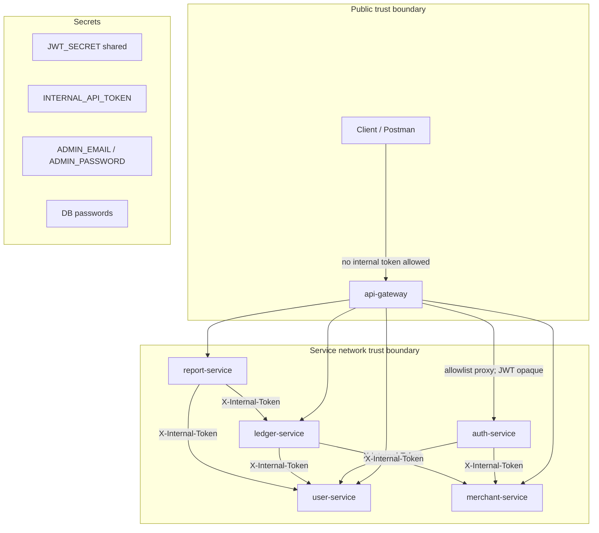
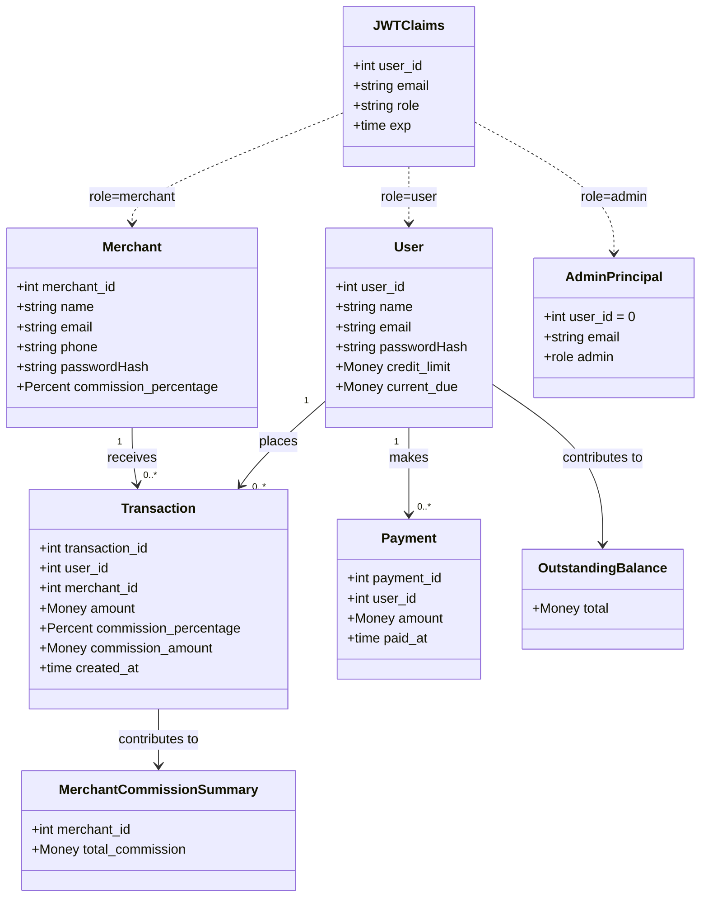
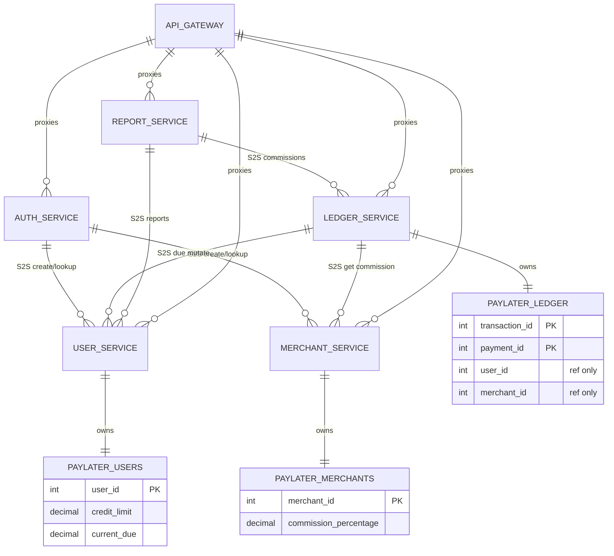

# PayLater Microservices — Domain / System Ontology

> Formal ontology grounded in the codebase. Companion: [PROJECT_ANALYSIS.md](./PROJECT_ANALYSIS.md).  
> Do not invent entities, tables, or endpoints absent from the repo.

---

## E. Domain ontology (formal)

### E1. Bounded contexts

| Bounded context | Ubiquitous language | Ownership service | Store |
|-----------------|---------------------|-------------------|-------|
| **Identity & Access** | register, login, JWT, role (`user` \| `merchant` \| `admin`), admin principal | auth-service (issuance); validation in every JWT-protected service via `shared` | none (credentials live in User/Merchant contexts; admin in env) |
| **Customer Credit** | user, credit limit, current due, increase/decrease due, outstanding balance | user-service | `paylater_users` |
| **Merchant Catalog** | merchant, commission percentage (3–20), profile | merchant-service | `paylater_merchants` |
| **Ledger** | purchase/transaction, repayment/payment, commission snapshot, compensation | ledger-service | `paylater_ledger` |
| **Reporting** | outstanding balance, users due, users at credit limit, merchant commissions | report-service (orchestration); aggregates computed in user/ledger | none (BFF) |
| **Edge / Public API** | allowlist, request id, strip internal token, block internal | api-gateway | none |

---

### E2. Entity catalog

#### User

| | |
|--|--|
| **Definition** | BNPL customer with a credit facility and outstanding due balance |
| **Identity** | `user_id` (INT AUTO_INCREMENT) |
| **Attributes** | `name` VARCHAR(100); `email` VARCHAR(255) UNIQUE; `password` bcrypt hash VARCHAR(255); `credit_limit` DECIMAL(10,2) DEFAULT 2000.00; `current_due` DECIMAL(10,2) DEFAULT 0.00 |
| **Invariants** | email unique; `current_due ≥ 0` (enforced by decrease rule, not DB CHECK); increase: `amount > 0` and `current_due + amount ≤ credit_limit`; decrease: `amount > 0` and `amount ≤ current_due`; password min length 6 at API bind |
| **Lifecycle** | Created (register/admin/internal) → Active (due mutates via ledger) — no soft-delete/status field |
| **Owner** | user-service / `users` |

#### Merchant

| | |
|--|--|
| **Definition** | Seller that receives PayLater purchases and earns commission |
| **Identity** | `merchant_id` |
| **Attributes** | `name`, `email` UNIQUE, `phone`, `password_hash`, `commission_percentage` DECIMAL(5,2) |
| **Invariants** | commission ∈ **[3, 20]** inclusive (service rule); email unique; password min 6 |
| **Lifecycle** | Created → Active; commission updatable by admin |
| **Owner** | merchant-service / `merchants` |

#### Transaction (Purchase)

| | |
|--|--|
| **Definition** | Immutable purchase record with commission **snapshotted** at buy time |
| **Identity** | `transaction_id` |
| **Attributes** | `user_id`, `merchant_id` (cross-service IDs, no FK); `amount` DECIMAL CHECK > 0; `commission_percentage` ≥ 0; `commission_amount` ≥ 0; `created_at` |
| **Invariants** | amount > 0; commission fields ≥ 0 (DB); business commission range enforced when reading merchant profile, not re-validated on insert; amount normalized to 2dp before due + insert |
| **Lifecycle** | Created on successful purchase; no update/cancel API |
| **Owner** | ledger-service / `transactions` |

#### Payment (Repayment)

| | |
|--|--|
| **Definition** | Record of a user reducing outstanding due |
| **Identity** | `payment_id` |
| **Attributes** | `user_id`; `amount` DECIMAL CHECK > 0; `paid_at` |
| **Invariants** | amount > 0; must not exceed `current_due` at decrease time (user-service) |
| **Lifecycle** | Created on successful repay; no delete API |
| **Owner** | ledger-service / `payments` |

#### AdminPrincipal

| | |
|--|--|
| **Definition** | Non-persisted operator authenticated against env credentials |
| **Identity** | Logical only; JWT `user_id=0`, `role=admin`, email = `ADMIN_EMAIL` |
| **Attributes** | `ADMIN_EMAIL`, `ADMIN_PASSWORD` (plaintext env comparison) |
| **Invariants** | Exact match on email+password; not stored in DB |
| **Owner** | auth-service (config) |

#### JWTClaims

| | |
|--|--|
| **Definition** | Signed bearer identity shared across services |
| **Identity** | Token string (HS256) |
| **Attributes** | `user_id` int32; `email`; `role`; `exp`/`iat` (24h TTL) |
| **Invariants** | Valid signature with shared `JWT_SECRET`; Bearer scheme; role one of user/merchant/admin in practice |
| **Owner** | Issued by auth-service; validated by shared middleware in user/merchant/ledger/report |

#### Report aggregates (read models, ephemeral)

| Aggregate | Definition | Source | Identity |
|-----------|------------|--------|----------|
| **OutstandingBalance** | Platform-wide Σ `current_due` | user-service SQL | singleton value string |
| **UserDueRow** | Per-user due listing | user-service | `user_id` |
| **UserAtCreditLimit** | Users with `current_due ≥ credit_limit` | user-service | `user_id` |
| **MerchantCommissionSummary** | Σ `commission_amount` by `merchant_id` | ledger-service | `merchant_id` (no name) |

Not persisted in report-service; recomputed on each request.

---

### E3. Value objects / concepts

| Concept | Representation | Notes |
|---------|----------------|-------|
| **Money / amount** | API `float64`; store DECIMAL(10,2) string in Go layers; ledger `NormalizeAmount` → 2dp | Technical debt: float at boundaries |
| **Commission percentage** | float64 in / DECIMAL string out; domain range 3–20 | Snapshot copied onto Transaction |
| **Commission amount** | `amount × percentage / 100`, rounded 2dp | Computed at purchase |
| **Email** | string; Gin `binding:"email"`; UNIQUE in user/merchant tables | Separate namespaces (user vs merchant can share email UNVERIFIED — no cross-DB uniqueness) |
| **Role** | `"user"` \| `"merchant"` \| `"admin"` | In JWT claim `role` |
| **Internal token** | Opaque shared secret string | Header `X-Internal-Token`; fail closed if env empty |
| **Request ID** | `X-Request-ID` (generated or accepted if alphanumeric/-/_ ≤128) | Gateway middleware |
| **Credit limit** | DECIMAL; default 2000.00 | Ceiling for `current_due` |
| **Outstanding due (`current_due`)** | DECIMAL; sole write owner user-service | Reduced by repayments, increased by purchases |
| **Password** | Plaintext at register/login APIs; bcrypt at rest | Cost = bcrypt.DefaultCost |

---

### E4. Relationships (graph)

Cardinality: `1`, `0..1`, `1..*`, `0..*`.  
**Stored** = local column/FK-like id in owner DB. **Referenced** = ID known across services without FK.

| Subject | Predicate | Object | Cardinality | Storage |
|---------|-----------|--------|-------------|---------|
| User | owes | DueBalance (`current_due`) | 1 — 1 | Stored (user row) |
| User | has | CreditLimit | 1 — 1 | Stored |
| User | places | Purchase (Transaction) | 1 — 0..* | Referenced (`transactions.user_id`) |
| Purchase | at | Merchant | * — 1 | Referenced (`transactions.merchant_id`) |
| Purchase | earns / snapshots | Commission | 1 — 1 | Stored on transaction |
| User | makes | Payment | 1 — 0..* | Referenced (`payments.user_id`) |
| Payment | reduces | DueBalance | * — 1 | Effect via S2S DecreaseDue (not FK) |
| Purchase | increases | DueBalance | * — 1 | Effect via S2S IncreaseDue |
| AuthService | issues | JWT | for Actor | — | Ephemeral |
| JWT | identifies | User \| Merchant \| AdminPrincipal | 1 — 1 | Claim `user_id` + `role` |
| ReportService | aggregates | OutstandingBalance | from UserService | — | Computed |
| ReportService | aggregates | MerchantCommissions | from LedgerService | — | Computed |
| LedgerService | compensates | DueBalance | on insert failure | — | Compensating S2S call |
| Gateway | strips | InternalToken | from client | — | Middleware |
| Gateway | blocks | InternalPath | from public | — | Middleware |

Ontology triples (compact):

```text
User —owes→ DueBalance
User —hasLimit→ CreditLimit
User —places→ Purchase
Purchase —at→ Merchant
Purchase —snapshots→ Commission
User —makes→ Payment
Payment —reduces→ DueBalance
Purchase —increases→ DueBalance
AuthService —issues→ JWTClaims
JWTClaims —authenticates→ Actor
ReportService —reads→ OutstandingBalance (UserService)
ReportService —reads→ MerchantCommissionSummary (LedgerService)
Actor —accessesVia→ ApiGateway
```

---

### E5. Capability / process ontology

| Capability | Services | Primary APIs | Domain rules |
|------------|----------|--------------|--------------|
| **Register** (user) | auth → user | `POST /register` → `POST /internal/users` | unique email; password ≥6; bcrypt; default credit 2000 / due 0 |
| **Register** (merchant) | auth → merchant | `POST /merchant/register` → `POST /internal/merchants` | commission 3–20; unique email |
| **Authenticate** | auth (+user/merchant lookup) | `/login`, `/merchant/login`, `/admin/login` | bcrypt verify or env admin; JWT 24h |
| **ManageCredit** | user (mutations); ledger (orchestrates) | internal due increase/decrease | credit check; no negative due; `FOR UPDATE` |
| **Purchase** | ledger → merchant → user → ledger DB | `POST /purchases` | amount > 0; merchant exists; increase due then insert; compensate on insert fail |
| **Repay** | ledger → user → ledger DB | `POST /payments` | amount > 0; ≤ due; decrease then insert; compensate on fail |
| **AdministerMerchants** | merchant | admin CRUD + commission PUT | admin role; commission 3–20 |
| **AdministerUsers** | user | admin list/create; get user | admin or self for get |
| **Report** | report → user/ledger | `/admin/reports/*` | admin only; live aggregates |
| **EdgeProtect** | gateway | all public paths | allowlist; strip token; block `/internal` |

---

### E6. Event / fact vocabulary

No message bus or event store exists. Facts are **implicit** (DB rows / logs) unless noted.

| Fact | Meaning | Materialization today |
|------|---------|------------------------|
| `UserRegistered` | New user row | DB insert (+ auth 201 message) |
| `MerchantRegistered` | New merchant row | DB insert |
| `AdminAuthenticated` | Admin JWT issued | JWT only |
| `UserAuthenticated` / `MerchantAuthenticated` | Role JWT issued | JWT only |
| `PurchaseRecorded` | Transaction inserted | `transactions` row |
| `DueIncreased` | Credit used | `users.current_due` update |
| `DueDecreased` | Credit freed | `users.current_due` update |
| `PaymentRecorded` | Repayment inserted | `payments` row |
| `CommissionSnapshotted` | Commission frozen on purchase | columns on `transactions` |
| `CommissionUpdated` | Merchant rate changed | `merchants.commission_percentage` (does not rewrite past txs) |
| `CompensationSucceeded` | Due rolled back after ledger insert fail | Opposite due API + ERROR log |
| `CompensationFailed` | Due left inconsistent | **CRITICAL** log only — no durable saga record |
| `ReportQueried` | Admin read aggregate | Ephemeral HTTP response |

**Explicit domain events: none today.**

---

### E7. Security ontology



| Actor | Credentials | Authorization rules |
|-------|-------------|---------------------|
| **User** | email+password → JWT role=user | Own purchases/payments; `GET /users/:id` only if self (or admin) |
| **Merchant** | email+password → JWT role=merchant | Own profile; own transactions list (JWT id) |
| **Admin** | env email+password → JWT role=admin, id=0 | All `/admin/*` routes; reports |
| **S2S caller** | `X-Internal-Token` | Internal create/lookup/due/reports only |

**Trust rules:**

- Gateway never validates JWT; never holds internal token.
- Client-supplied `X-Internal-Token` is deleted before proxy (`StripInternalToken` + proxy Director).
- `/internal/*` from public → 404 at gateway (defense in depth); services still require token if reached directly.
- Internal responses may include password hashes for auth/ledger orchestration — must not be exposed via public handlers (public DTOs omit them).

---

### E8. Ontology diagrams

#### Domain entities



#### Service ownership & trust



---

## J. Glossary

| Term | Meaning in PayLater |
|------|---------------------|
| **Admin** | Env-authenticated operator; JWT `role=admin`, `user_id=0` |
| **API Gateway** | Public allowlist reverse proxy on `:8080`; no JWT validation |
| **At credit limit** | `current_due ≥ credit_limit` |
| **Commission** | Merchant fee percentage (3–20%); amount = purchase × pct / 100, snapshotted on transaction |
| **Compensation** | Compensating REST call reversing a due mutation after ledger insert failure |
| **Credit limit** | Maximum allowed `current_due` for a user (default 2000.00) |
| **Current due / outstanding due** | Amount the user currently owes; sole write owner: user-service |
| **Internal token** | Shared secret in header `X-Internal-Token` for S2S calls |
| **JWT** | HS256 bearer token, 24h; claims user_id, email, role |
| **Ledger** | Service owning purchases and payments records |
| **Merchant** | Seller entity with commission rate |
| **Outstanding balance (report)** | Sum of all users' `current_due` |
| **Payment / repayment** | User paying down due; recorded in `payments` |
| **Purchase / transaction** | BNPL buy at a merchant; recorded in `transactions` |
| **Report BFF** | report-service aggregating other services for admin |
| **Role** | `user`, `merchant`, or `admin` |
| **Saga (REST)** | Multi-step purchase/repay flow with manual compensation (not a formal saga log) |
| **User** | Customer with credit facility |

---

## Ontology cheat sheet (1 page)

### Who owns what

| Entity / concept | Owner | Store |
|------------------|-------|-------|
| User, credit_limit, current_due | **user-service** | `paylater_users.users` |
| Merchant, commission % | **merchant-service** | `paylater_merchants.merchants` |
| Purchase (tx), Payment | **ledger-service** | `paylater_ledger` |
| JWT issuance | **auth-service** | — |
| Admin credentials | **auth-service** env | — |
| Admin reports (API) | **report-service** | — (reads owners) |
| Public edge | **api-gateway** | — |

### Top invariants

1. **`current_due ≥ 0`** and never exceeds **`credit_limit`** on increase.
2. **Purchase amount > 0**; repay amount > 0 and **≤ current_due**.
3. **Commission ∈ [3, 20]** on merchant create/update.
4. **Purchase:** IncreaseDue → INSERT tx; on insert fail → DecreaseDue (same 2dp amount).
5. **Repay:** DecreaseDue → INSERT payment; on insert fail → IncreaseDue.
6. **Ledger IDs** reference users/merchants **without cross-DB FKs**; commission on tx is a **snapshot**.
7. **JWT** validated per service; gateway does **not** authZ; **`X-Internal-Token`** required for `/internal/*` (fail closed); gateway **strips** client tokens and **404s** `/internal/*`.
8. **Money** stored as DECIMAL; ledger normalizes to **2 decimal places**; APIs still use float64 (**debt**).

### Capability → service (quick)

```text
Register/Login  → auth (+ user/merchant)
Manage due      → user (ledger orchestrates)
Purchase/Repay  → ledger
Admin merchants → merchant
Admin reports   → report → user | ledger
Public entry    → gateway
```

### Consistency warning

Compensation is **best-effort**. `CompensationFailed` is logged as CRITICAL with **no reconciliation worker** — due and ledger can diverge until manually fixed.
