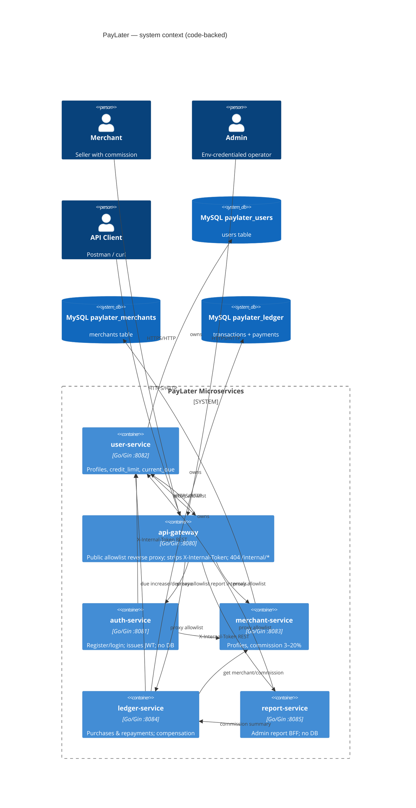
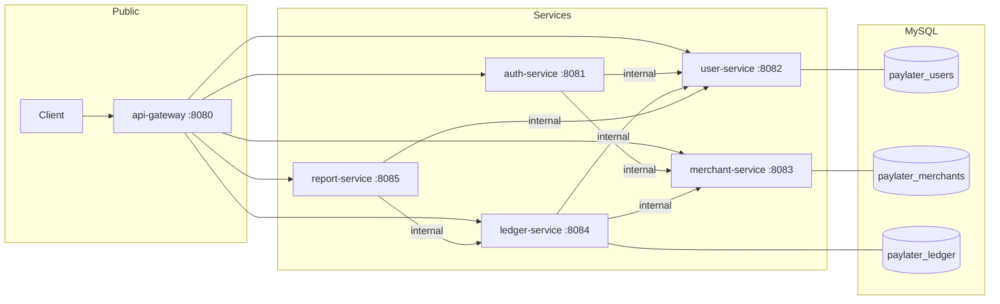
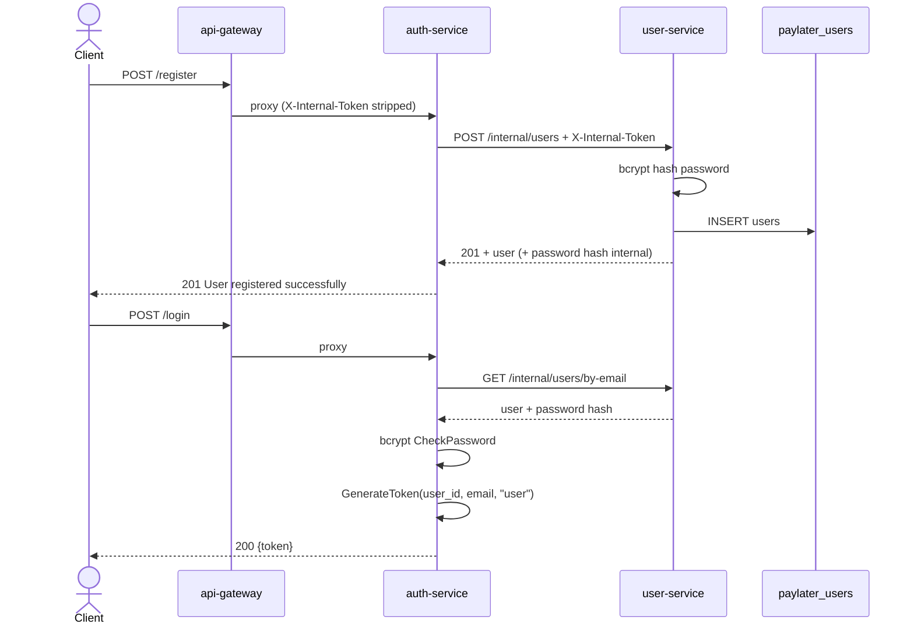
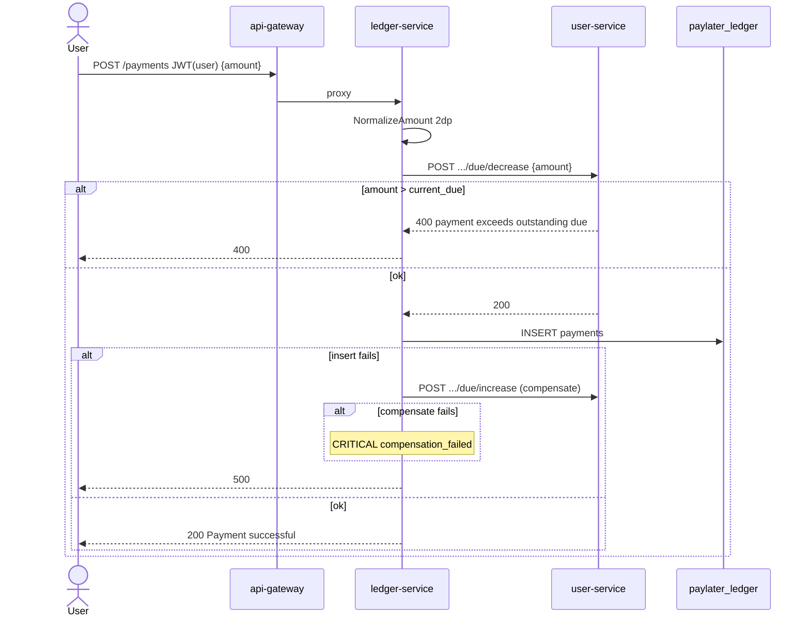
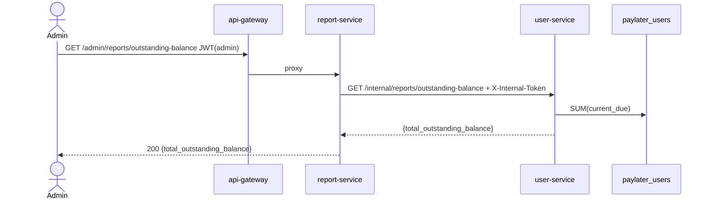
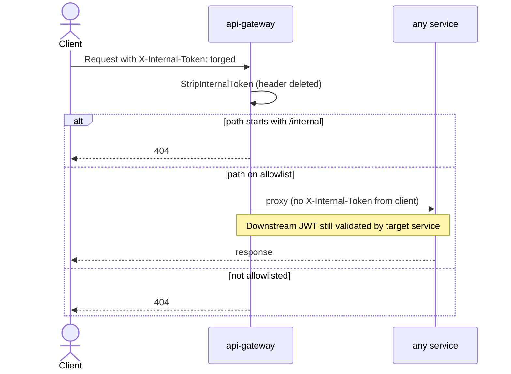

# PayLater Microservices — Project Analysis

> Codebase-backed analysis of `paylater-microservices`. Companion document: [ONTOLOGY.md](./ONTOLOGY.md).  
> Sources of truth: routes, schemas, services, clients, shared packages. READMEs cited only when they match code; drift is called out explicitly.

---

## A. Executive summary

**PayLater** is a buy-now-pay-later platform extracted from a modular monolith (`../paylater`) into a Go monorepo of independently runnable microservices (Go 1.25+, Gin). Clients should talk only to the **API Gateway** (`:8080`). Downstream services own domains and (where applicable) MySQL databases. Auth is JWT HS256 at each service; the gateway does **not** validate JWTs. Service-to-service calls use a shared secret header `X-Internal-Token`.

**Architectural thesis:** database-per-service + explicit public gateway allowlist + JWT roles at the edge of each service + fail-closed internal token for S2S + REST compensation sagas for purchase/repay consistency.

**Maturity vs README claims:** The root [README.md](../README.md) still describes **Phase 0** (scaffold, health-only, no SQL/S2S/Docker). That is **obsolete**. The codebase implements auth, user, merchant, ledger, report, and api-gateway with real APIs, sqlc MySQL ownership (three DBs), S2S REST clients, and compensation. Service READMEs are closer to reality but still lag (e.g. user/merchant “not wired yet”). Docker Compose remains a stub (`docker/README.md`).

| Claim (root README) | Reality (code) |
|---------------------|----------------|
| Phase 0 only; health checks | Full business APIs across 6 services |
| No MySQL / sqlc | `paylater_users`, `paylater_merchants`, `paylater_ledger` + sqlc |
| No S2S REST | auth→user/merchant; ledger→user/merchant; report→user/ledger |
| No Docker Compose | Still true (placeholder only) |
| api-gateway absent from tree | Present: public reverse-proxy allowlist on `:8080` |

---

## B. System context diagram



Component view (S2S edges):



---

## C. Service catalog

Package layout pattern (confirmed):  
`cmd/server` → config → DB/sqlc (where owned) → repository → service → handler → routes.  
Auth/report/gateway skip DB. Shared libs via Go `replace` → `../../shared`.

### C1. api-gateway

| | |
|--|--|
| **Responsibility** | Public reverse-proxy allowlist; request ID; access log; strip client `X-Internal-Token`; block `/internal/*` |
| **Non-responsibility** | JWT validation, roles, DB, internal token minting/holding |
| **Port** | `8080` (`SERVER_PORT`) |
| **Config** | `AUTH/USER/MERCHANT/LEDGER/REPORT_SERVICE_URL`; proxy timeouts hardcoded in `internal/config/config.go` |
| **Data owned** | none |
| **Inbound** | External clients |
| **Outbound** | httputil reverse proxy to five services |
| **Failure modes** | Downstream dial/timeout → **503** `{"error":"service unavailable"}` (`internal/proxy/proxy.go`); unknown paths → Gin 404; `/internal/*` → 404 |

**Public API (allowlist only)** — see section H. No internal API.

Evidence: `services/api-gateway/internal/routes/routes.go`, `internal/middleware/middleware.go`.

---

### C2. auth-service

| | |
|--|--|
| **Responsibility** | User/merchant register & login; admin login from env; issue JWT |
| **Non-responsibility** | Storing credentials; hashing (delegated to user/merchant); due/credit; purchases |
| **Port** | `8081` |
| **Config** | `JWT_SECRET`, `ADMIN_EMAIL`, `ADMIN_PASSWORD`, `USER_SERVICE_URL`, `MERCHANT_SERVICE_URL`, `INTERNAL_API_TOKEN` (required at startup) |
| **Data owned** | none |
| **Outbound** | user-service + merchant-service internal REST |
| **Failure modes** | Downstream down → **503**; bad creds → **401**; duplicate email → **400** |

**Public API**

| Method | Path | Auth |
|--------|------|------|
| GET | `/health` | none |
| POST | `/register` | none |
| POST | `/login` | none → JWT `role=user` |
| POST | `/merchant/register` | none |
| POST | `/merchant/login` | none → JWT `role=merchant` |
| POST | `/admin/login` | none → JWT `role=admin`, `user_id=0` |

No `/internal` routes.

Evidence: `services/auth-service/internal/service/auth_service.go`, `internal/client/*`.

---

### C3. user-service

| | |
|--|--|
| **Responsibility** | User profiles; sole owner of `credit_limit` and `current_due`; atomic due mutations; internal report aggregates |
| **Non-responsibility** | Auth issuance; ledger rows; merchant data |
| **Port** | `8082` |
| **Config** | `DB_*` (`DB_NAME` default `paylater_users`), `JWT_SECRET`, `INTERNAL_API_TOKEN` (fail-closed for `/internal`) |
| **Data owned** | `paylater_users.users` |
| **Inbound** | Gateway (public/admin); auth, ledger, report (internal) |
| **Failure modes** | Insufficient credit / payment exceeds due → **400**; not found → **404**; missing internal token → **401** |

**Public / admin API**

| Method | Path | Auth |
|--------|------|------|
| GET | `/health` | none |
| GET | `/users/:id` | JWT; **self or admin** |
| GET | `/admin/users` | JWT admin |
| POST | `/admin/users` | JWT admin |

**Internal API** (`X-Internal-Token`)

| Method | Path | Callers |
|--------|------|---------|
| POST | `/internal/users` | auth |
| GET | `/internal/users/by-email` | auth |
| GET | `/internal/users/:id` | (available; auth uses by-email) |
| POST | `/internal/users/:id/due/increase` | ledger |
| POST | `/internal/users/:id/due/decrease` | ledger |
| GET | `/internal/reports/outstanding-balance` | report |
| GET | `/internal/reports/users-due` | report |
| GET | `/internal/reports/users-at-credit-limit` | report |

**Invariants (code):** `amount > 0`; on increase `amount ≤ credit_limit - current_due`; on decrease `amount ≤ current_due`; `FOR UPDATE` in tx (`user_service.go`). Default `credit_limit=2000.00`, `current_due=0.00` (`sql/schema.sql`).

---

### C4. merchant-service

| | |
|--|--|
| **Responsibility** | Merchant profiles; `commission_percentage` (3–20 inclusive) |
| **Non-responsibility** | Transactions; dues; JWT issuance |
| **Port** | `8083` |
| **Config** | `DB_*` (`paylater_merchants`), `JWT_SECRET`, `INTERNAL_API_TOKEN` |
| **Data owned** | `paylater_merchants.merchants` |
| **Inbound** | Gateway; auth (create/lookup); ledger (get by id) |
| **Failure modes** | Invalid commission / email exists → **400**; not found → **404** |

**Public / admin API**

| Method | Path | Auth |
|--------|------|------|
| GET | `/health` | none |
| GET | `/merchant/profile` | JWT merchant (ID from token only) |
| POST | `/admin/merchants` | JWT admin |
| GET | `/admin/merchants` | JWT admin |
| GET | `/admin/merchants/:id` | JWT admin |
| PUT | `/admin/merchants/:id/commission` | JWT admin |

**Internal API**

| Method | Path | Callers |
|--------|------|---------|
| POST | `/internal/merchants` | auth |
| GET | `/internal/merchants/by-email` | auth |
| GET | `/internal/merchants/:id` | ledger |

---

### C5. ledger-service

| | |
|--|--|
| **Responsibility** | Purchases (`transactions`) and repayments (`payments`); commission snapshot at purchase; REST compensation for due |
| **Non-responsibility** | Mutating user/merchant DBs directly; admin reports BFF (report-service) |
| **Port** | `8084` |
| **Config** | `DB_*` (`paylater_ledger`), `JWT_SECRET`, `USER_SERVICE_URL`, `MERCHANT_SERVICE_URL`, `INTERNAL_API_TOKEN` (required) |
| **Data owned** | `transactions`, `payments` |
| **Outbound** | user (due), merchant (commission) |
| **Failure modes** | Downstream unavailable → **503**; credit/due rules → **400**; insert fail after due mutate → compensate; compensate fail → **500** + `CRITICAL compensation_failed` log |

**Public / role API**

| Method | Path | Auth |
|--------|------|------|
| GET | `/health` | none |
| POST | `/purchases` | JWT user (user_id from token) |
| POST | `/payments` | JWT user |
| GET | `/payments` | JWT user (own) |
| GET | `/merchant/transactions` | JWT merchant (own txs) |
| GET | `/admin/purchases` | admin |
| GET | `/admin/purchases/:id` | admin |
| GET | `/admin/users/:id/purchases` | admin |
| GET | `/admin/payments/:id` | admin |
| GET | `/admin/users/:id/payments` | admin |

**Internal API**

| Method | Path | Callers |
|--------|------|---------|
| GET | `/internal/reports/merchant-commissions` | report |

Money: amounts normalized to 2dp (`internal/money/money.go`); API still `float64` (documented debt).

---

### C6. report-service

| | |
|--|--|
| **Responsibility** | Admin report BFF; aggregates via owning services |
| **Non-responsibility** | Persistence; enrichment; pagination; caching |
| **Port** | `8085` |
| **Config** | `JWT_SECRET`, `USER_SERVICE_URL`, `LEDGER_SERVICE_URL`, `INTERNAL_API_TOKEN` (required) |
| **Data owned** | none |
| **Failure modes** | Downstream down → **503**; malformed response → **500** |

**Public API (admin only)**

| Method | Path | Auth |
|--------|------|------|
| GET | `/health` | none |
| GET | `/admin/reports/outstanding-balance` | admin |
| GET | `/admin/reports/users-due` | admin |
| GET | `/admin/reports/users-at-credit-limit` | admin |
| GET | `/admin/reports/merchant-commissions` | admin |

No `/internal` routes on report-service itself.

---

## D. End-to-end sequence diagrams

### D1. User register + login



### D2. Merchant register + login

```mermaid
sequenceDiagram
  actor Client
  participant GW as api-gateway
  participant Auth as auth-service
  participant Merch as merchant-service
  participant DB as paylater_merchants

  Client->>GW: POST /merchant/register
  Note over Client,Auth: body includes commission_percentage
  GW->>Auth: proxy
  Auth->>Merch: POST /internal/merchants
  Merch->>Merch: validate commission 3..20; bcrypt
  Merch->>DB: INSERT merchants
  Merch-->>Auth: 201
  Auth-->>Client: 201 merchant registered successfully

  Client->>GW: POST /merchant/login
  GW->>Auth: proxy
  Auth->>Merch: GET /internal/merchants/by-email
  Auth->>Auth: CheckPassword; JWT role=merchant, user_id=merchant_id
  Auth-->>Client: 200 {token}
```

### D3. Admin login

```mermaid
sequenceDiagram
  actor Client
  participant GW as api-gateway
  participant Auth as auth-service

  Client->>GW: POST /admin/login {email,password}
  GW->>Auth: proxy
  Auth->>Auth: compare ADMIN_EMAIL / ADMIN_PASSWORD (env)
  alt mismatch
    Auth-->>Client: 401 invalid admin credentials
  else match
    Auth->>Auth: GenerateToken(0, adminEmail, "admin")
    Auth-->>Client: 200 {token}
  end
  Note over Auth: No DB; no user/merchant S2S
```

### D4. Purchase (happy path + compensation)

```mermaid
sequenceDiagram
  actor User
  participant GW as api-gateway
  participant Led as ledger-service
  participant Merch as merchant-service
  participant Usr as user-service
  participant DB as paylater_ledger

  User->>GW: POST /purchases JWT(user) {merchant_id, amount}
  GW->>Led: proxy
  Led->>Led: NormalizeAmount 2dp
  Led->>Merch: GET /internal/merchants/:id
  Merch-->>Led: commission_percentage
  Led->>Led: CommissionAmount = amount * pct / 100
  Led->>Usr: POST .../due/increase {amount}
  Usr->>Usr: FOR UPDATE; credit check
  alt insufficient credit
    Usr-->>Led: 400
    Led-->>User: 400 insufficient credit limit
  else ok
    Usr-->>Led: 200
    Led->>DB: INSERT transactions
    alt insert fails
      Led->>Usr: POST .../due/decrease (same amount)
      alt compensate ok
        Led-->>User: 500 internal error
        Note over Led: ERROR ledger_insert_failed_compensated
      else compensate fails
        Led-->>User: 500
        Note over Led: CRITICAL compensation_failed
      end
    else insert ok
      Led-->>User: 201 Purchase successful
    end
  end
```

### D5. Repayment (happy path + compensation)



### D6. Admin report — outstanding-balance



### D7. Request through API gateway (strip token / block internal)



---

## F. Data ownership & consistency model

### Database-per-service map

| Database | Owner | Tables |
|----------|-------|--------|
| `paylater_users` | user-service | `users` |
| `paylater_merchants` | merchant-service | `merchants` |
| `paylater_ledger` | ledger-service | `transactions`, `payments` |
| — | auth, report, gateway | none |

### Cross-service references

- Ledger stores `user_id` / `merchant_id` as **local ints with indexes, not FKs** to other DBs (`sql/schema.sql`).
- JWT `user_id` carries user or merchant ID (or `0` for admin); claim field is always named `user_id`.
- Commission on a transaction is a **snapshot** (`commission_percentage`, `commission_amount`) at purchase time — later merchant commission updates do not rewrite history.

### Consistency: sync REST + compensation

**Purchase happy path:** GetMerchant → IncreaseDue → INSERT transaction.  
**Purchase failure after IncreaseDue:** DecreaseDue(same normalized amount).  
**Repay happy path:** DecreaseDue → INSERT payment.  
**Repay failure after DecreaseDue:** IncreaseDue(same amount).

**Not strongly consistent today:**

- No distributed transaction / outbox / saga log.
- Compensation is best-effort; failure leaves due mutated without ledger row (`CRITICAL` log only).
- No idempotency keys; retries can double-apply if client retries after partial success.
- Report reads are point-in-time REST aggregates, not a transactional snapshot across services.
- float64 API ↔ DECIMAL store can introduce rounding edge cases (mitigated partially by 2dp normalize in ledger).

---

## G. Cross-cutting concerns

| Concern | Implementation |
|---------|----------------|
| **AuthN** | JWT HS256, 24h TTL; claims `user_id`, `email`, `role` (`shared/auth/jwt.go`) |
| **AuthZ** | `AuthMiddleware` + `RequireRole`; user self-or-admin on `GET /users/:id`; merchant ID from JWT for profile/txs |
| **Internal S2S** | `X-Internal-Token` == `INTERNAL_API_TOKEN`; fail closed if unset; gateway strips + blocks `/internal` |
| **Passwords** | bcrypt in user/merchant services (`shared/auth/password.go`); auth verifies hashes returned on internal APIs |
| **Money** | MySQL DECIMAL; ledger normalizes to 2dp; APIs still float64 |
| **Responses** | `{"error":"..."}` / `{"message":"..."}` / arbitrary JSON (`shared/response`) |
| **Logging** | Gateway access log with `request_id` + downstream; ledger CRITICAL compensation logs; no auth headers/bodies in gateway access log |
| **HTTP client** | `shared/httpclient` JSON client, 10s default timeout |
| **sqlc** | user, merchant, ledger (`sqlc.yaml` + generated `internal/db`) |
| **Testing** | Memory repos/fakes encode credit, commission 3–20, compensation success/fail (`*_service_test.go`, money tests, gateway route tests) |
| **Config** | per-service `.env.example`; shared `config.LoadConfig` for DB services; auth/ledger/report/gateway have local Load |

---

## H. API surface matrix

| Gateway path | Method | Downstream | Auth at downstream | Notes |
|--------------|--------|------------|--------------------|-------|
| `/health` | GET | gateway only | — | gateway health, not proxied |
| `/register` | POST | auth | none | |
| `/login` | POST | auth | none | returns JWT |
| `/merchant/register` | POST | auth | none | |
| `/merchant/login` | POST | auth | none | |
| `/admin/login` | POST | auth | none | env admin |
| `/users/:id` | GET | user | JWT self/admin | |
| `/admin/users` | GET | user | admin | |
| `/admin/users` | POST | user | admin | |
| `/merchant/profile` | GET | merchant | merchant | ID from JWT |
| `/admin/merchants` | POST | merchant | admin | |
| `/admin/merchants` | GET | merchant | admin | |
| `/admin/merchants/:id` | GET | merchant | admin | |
| `/admin/merchants/:id/commission` | PUT | merchant | admin | body `commission` |
| `/purchases` | POST | ledger | user | |
| `/payments` | POST | ledger | user | |
| `/payments` | GET | ledger | user | own payments |
| `/merchant/transactions` | GET | ledger | merchant | own txs |
| `/admin/purchases` | GET | ledger | admin | |
| `/admin/purchases/:id` | GET | ledger | admin | |
| `/admin/users/:id/purchases` | GET | ledger | admin | |
| `/admin/payments/:id` | GET | ledger | admin | |
| `/admin/users/:id/payments` | GET | ledger | admin | |
| `/admin/reports/outstanding-balance` | GET | report | admin | |
| `/admin/reports/users-due` | GET | report | admin | |
| `/admin/reports/users-at-credit-limit` | GET | report | admin | |
| `/admin/reports/merchant-commissions` | GET | report | admin | |
| `/internal/*` | * | — | — | **404 at gateway** |

Direct service ports remain reachable if network allows — gateway is policy, not a hard network boundary (UNVERIFIED whether prod firewall exists; no compose/network policy in repo).

---

## I. Gaps, risks, and evolution

Prioritized from code comments and READMEs:

1. **Idempotency / reconciliation (high)** — Ledger README: end-to-end idempotency missing; compensation failure has no worker. Failed compensate leaves `current_due` wrong relative to ledger.
2. **Money type hardening (high)** — float64 at API boundaries vs DECIMAL; only ledger normalizes to 2dp.
3. **Docs drift (medium)** — Root README Phase 0; user README “no S2S yet”; merchant README “not wired”; `docs/README.md` still Phase 0; shared/config comment still says Phase 0.
4. **Report limitations (medium)** — no merchant-name enrichment, pagination, caching, or read model (`report-service/README.md`).
5. **Docker Compose (medium)** — `docker/README.md` placeholder only.
6. **CORS (low for Postman, medium for browsers)** — gateway README: not configured (Phase 7).
7. **Internal auth strength (medium)** — shared static token; comment in middleware notes stronger S2S auth later.
8. **Admin as env principal (low/medium)** — no admin table; `user_id=0`; password in env.
9. **Gateway not a network choke point (medium)** — services expose full surfaces including `/internal` on their ports.

**Ontology-aligned future concepts (not implemented):**

| Concept | Purpose |
|---------|---------|
| Outbox / domain events | Explicit `PurchaseRecorded`, `DueIncreased`, etc. |
| Saga log | Persist compensation steps; drive retries |
| Reconciliation worker | Detect due vs Σ(purchases−payments) drift |
| Report read model | Denormalized merchant names, pagination |
| Money minor-units / decimal type | Cross-service amount safety |
| mTLS or signed S2S tokens | Replace static internal token |

---

## Tests that encode business rules

| Area | File | Rules covered |
|------|------|---------------|
| Credit / due | `user-service/.../user_service_test.go` | positive amount; insufficient credit; payment exceeds due; defaults 2000/0 |
| Commission | `merchant-service/.../merchant_service_test.go` | 3–20 inclusive; rejects outside |
| Purchase/repay + compensate | `ledger-service/.../ledger_service_test.go` | merchant missing; credit; commission calc; insert-fail compensate; compensate-fail leaves due |
| Money | `ledger-service/.../money_test.go` | 2dp normalize; commission calc |
| Internal token | `*/middleware/internal_auth_test.go` | fail closed |
| Gateway | `api-gateway/.../routes_test.go` | allowlist / internal block (verify in file for exact cases) |
| Reports | `user-service` / `ledger-service` / `report-service` report tests | aggregate shapes |

---

## README vs code drift (summary)

| Doc | Drift |
|-----|-------|
| Root `README.md` | Claims Phase 0; omits api-gateway; says no business APIs/SQL/S2S |
| `docs/README.md` | Still “Phase 0 scaffold only” |
| `user-service/README.md` | “no service-to-service REST yet” — but full internal API used by auth/ledger/report |
| `merchant-service/README.md` | “not wired to auth/ledger yet” — wired |
| `shared/config/config.go` comment | “Phase 0 does not connect to MySQL” — DB services do |
| Service READMEs (auth/ledger/report/gateway) | Largely accurate |

---

## Related

- Domain ontology: [ONTOLOGY.md](./ONTOLOGY.md)
